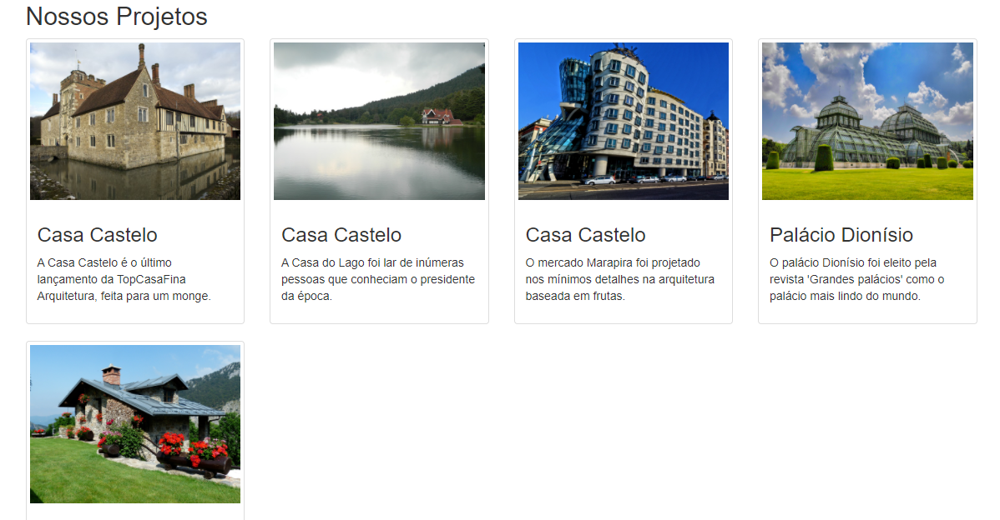

# Top casa fina arquitetura

Projeto feito para criar uma página resposivel com Bootstrap 3.

## Motivação

Projeto para fins de estudo, aprendizagem e prática em Bootstrap, CSS e HTML.

## Tecnologias utilizadas

- Bootstrap 3
- HTML
- CSS
- Visual Studio Code

## Autor

- Douglas Andrade dos Santos 
